# Andy's Portfolio

I close the source of anything that makes it past prototype phase and has the potential for revenue.
Those larger projects will be discussed here.

My [other GitHub repositories](https://github.com/andy98725) represent early prototypes or Proof of Concepts.
I've listed some interesting ones at the bottom with sample images.

## Overview

Each project has used a different language + framework, simply depending on its business requirements and the best tool for the job.

In particular, I plan out the software architecture ahead of time, leading to minimal tech debt and remarkably high SLA (99.9% uptime and a single digit crash rate) in these projects.

These projects commonly use multithreading to separate calculation-heavy (e.g. model updating) concerns from low-latency (rendering, API) concerns.

# Idle Elemental

| Application Layer | Language Framework |
| ----------------- | ------------------ |
| Client View | Flutter |
| Client Model | Riverpod (Flutter) |
| Deployment Environment | Google App Store, Firebase |

## Overview

Idle Elemental is an unfolding mobile game for [web](https://idleelem.net/) and [Google Play](https://play.google.com/store/apps/details?id=com.everlastinggames.idle_elemental&hl=en).
It launched on 4/21/2024 after 2 years of intermittent work.

Dart's Flutter framework was picked for its efficient rendering engine, similarity to React, and its cross platform compatibility.

This project was initially intended as an excercise in frontend design and optimizing for UX.
The page layout dynamically changes tightly coupled with game state, only showing features as they are unlocked.

It also includes calculus-level math implementation for finding the fluctuation of resource values for any given delta-time within a highly interconnected system. This is done for offline calculations and framerate optimization.

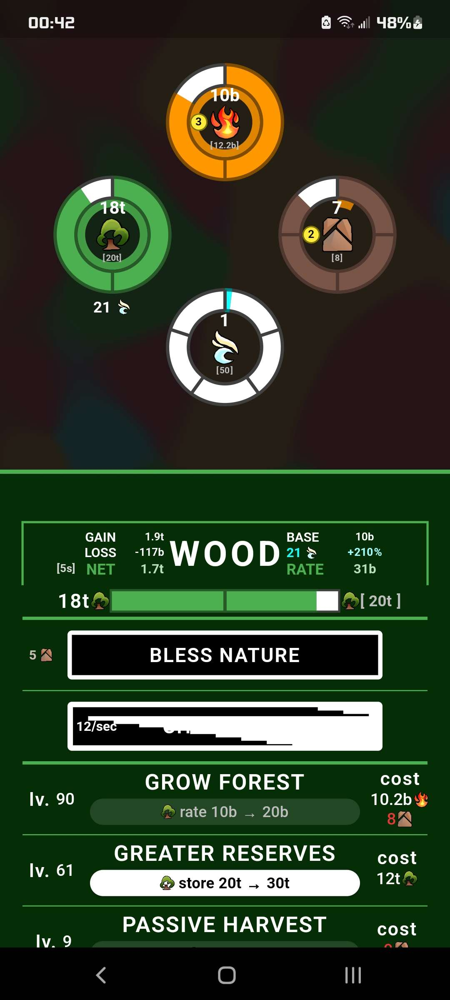
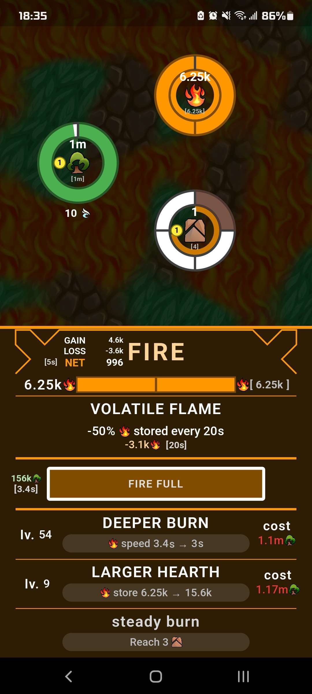

# Base Wars

| Application Layer | Language Framework |
| ----------------- | ------------------ |
| Client View | Java Swing |
| Client Model | Java Awt |
| Backend | Ruby on Rails |
| Deployment Environment | Steamworks, Heroku |

Base Wars published [on Steam](https://store.steampowered.com/app/1747110/Base_Wars/) in October of 2020, to critical success (~500 copies sold and counting).

I developed it in Java Swing starting in 2015. I would not make this choice again for a desktop video game; the lack of harmony of the rendering engine with the game's requirements is the achilles heel of the codebase.

After 5 years of development, Base Wars has a mature codebase of ~80,000 LoC with a variety of features:

- Netcode
    - Client & Server model, where the Server validates & propogates Events generated by Clients.
    - A Rails matchmaking server adds game clients to Redis queue and pairs them FIFO
- Multithreading
    - Render thread, input thread, and model update thread used to separate concerns and keep a consistent framerate
    - Asset loading thread used on startup
    - Immutable model state and event structure designed with synchronicity in mind to minimize race conditions
- UI design
    - Responsive frontend UI changes layouts according to screen size

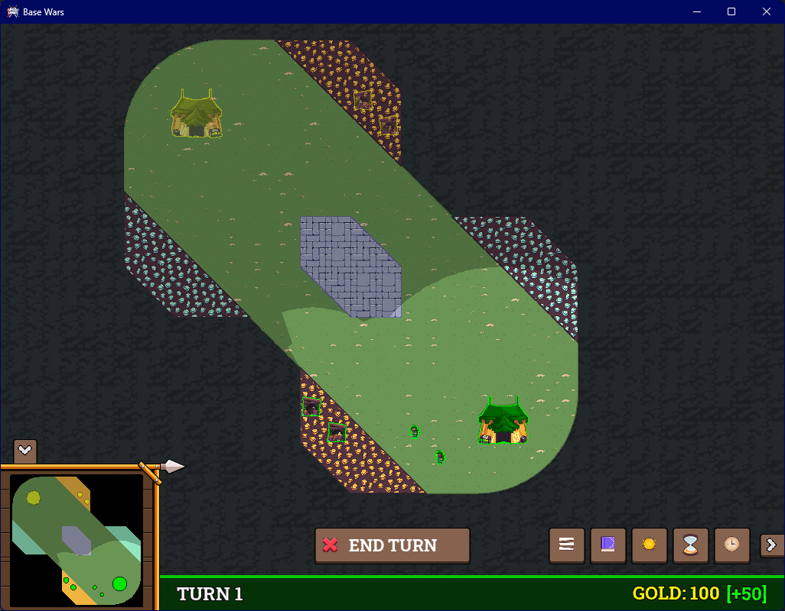
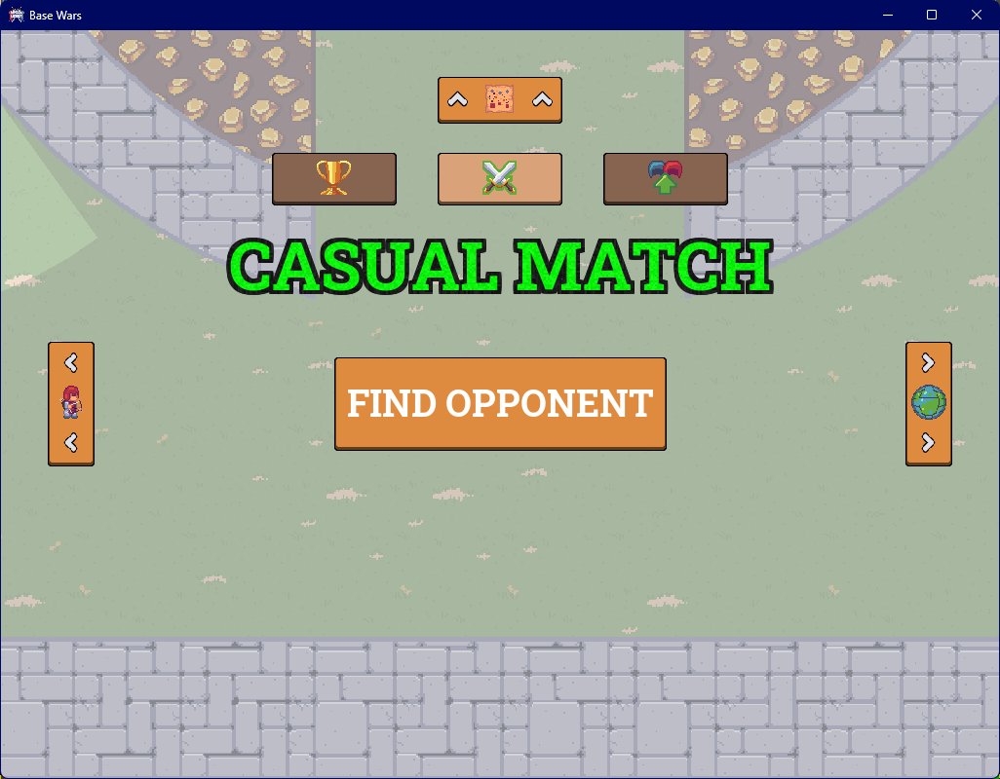
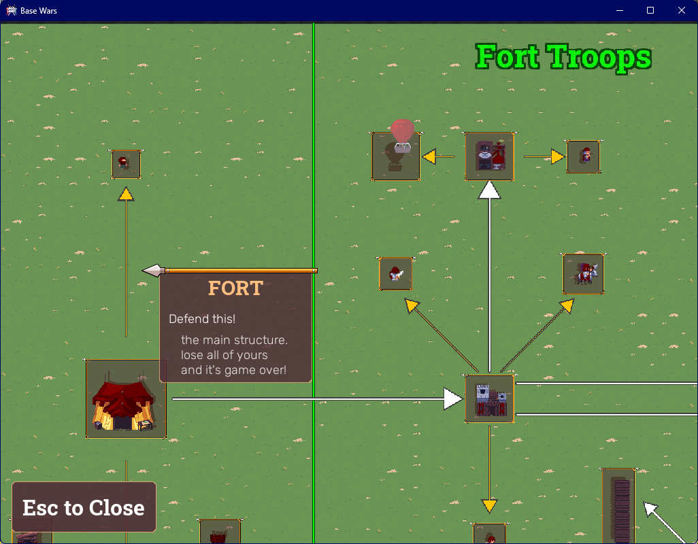

# Iperf Professional Edition

| Application Layer | Language Framework |
| ----------------- | ------------------ |
| Frontend | React |
| Backend | Node Express |
| Database | MySQL |
| Deployment Environment | Heroku |

## Overview

Iperf PE is a remote scheduling tool for [Iperf 2](https://sourceforge.net/projects/iperf2/).
It is hosted on [iperf-pe.net](https://iperf-pe.net/) for production and [stg.iperf-pe.net](http://stg.iperf-pe.net/) for staging.

The app is designed with a minimalist UI, presenting essential information efficiently and clearly to the user.
The concepts of Nodes and Tests are succinctly explained and their creation interface is designed to be as streamlined as possible.

The architecture is as follows:

- Frontend (React)
    - Stores session token & handles auth appropriately
    - Makes async API calls and renders relevant data into custom table components
- Backend (Node Express)
    - Uses Sequelize ORM to model & represent Database tables
    - Provides API to frontend for User management and CRUD operations on Nodes and Tests
    - Scheduler thread picks up Tests to be started and calls specified Nodes
- Database (MySQL)
- Nodes (Golang)
    - A Node is a remote server which the backend can call upon to start / stop Iperf Tests
    - Uses U/P auth to validate endpoint calls
    - Reports status, uptime, and test results to Backend
    - Runs inside a Docker image for environmental flexibility
    - Source and image are currently provided to the user as a GitHub release

## Next Steps

As Iperf PE is still in early prototype phase, there are still fundamental improvements to be done.

- Provide the Node's Docker image directly from a container registry
- Reimplement auth on Nodes as server-provided JWT
- Add a Garbage Collector thread for any bad state Tests

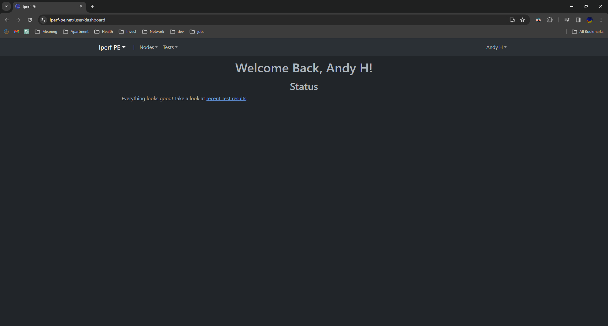
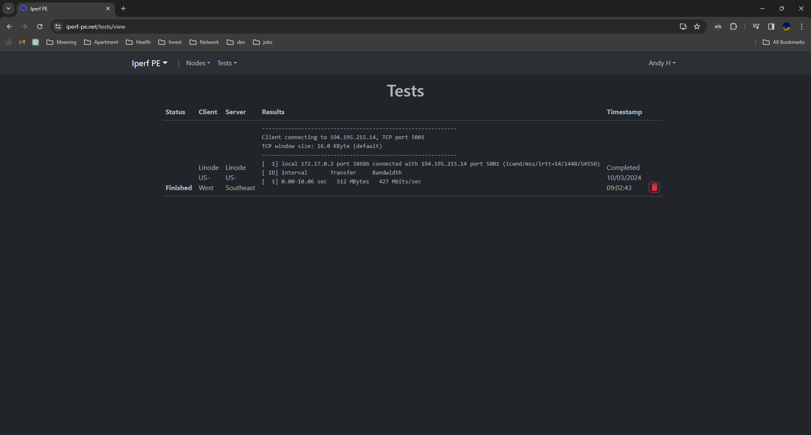

# Other Repositories

| Name | Description |
| ---- | ----------- |
| [haunt-jam](https://github.com/andy98725/haunt-jam) | A libGDX game made in 48 hours |
| [bw-launcher](https://github.com/andy98725/bw-launcher) | An Electron app that was used for version management |
| [triomino-tiling](https://github.com/andy98725/TriominoTiling) | A visually satisfying implementation of a triomino tiling theorem |
| [arbit-coin](https://github.com/andy98725/ArbitCoin) | A proof-of-concept cryptocurrency arbitrage detector |
| [true-movement](https://github.com/andy98725/True-Movement) | An original search algorithm for calculating true distance shapes |
| [bezier-curve-tangents](https://github.com/andy98725/Bezier-Curve-Tangents) | An original algorithm for finding tangent lines to any bezier curve |
| [mazenPy](https://github.com/andy98725/MazenPy) | A Reinforcement Learning implementation for solving mazes |
| [color-game](https://github.com/andy98725/Color_Game) | A cellular automata for generating clusters |
| [worms-n-guns](https://github.com/andy98725/Worms-N-Guns) | A proof of concept physics-based game |

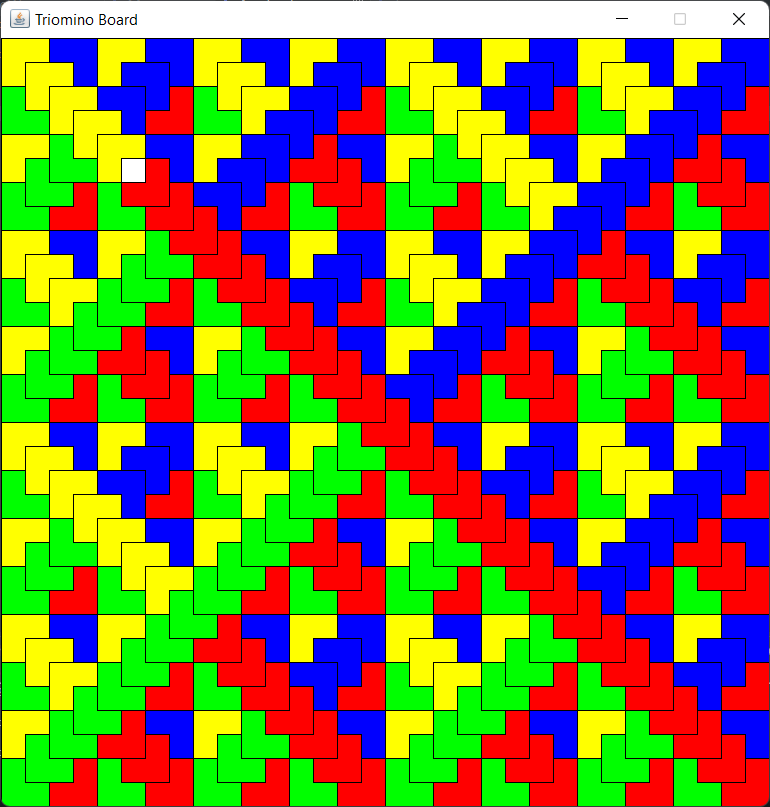
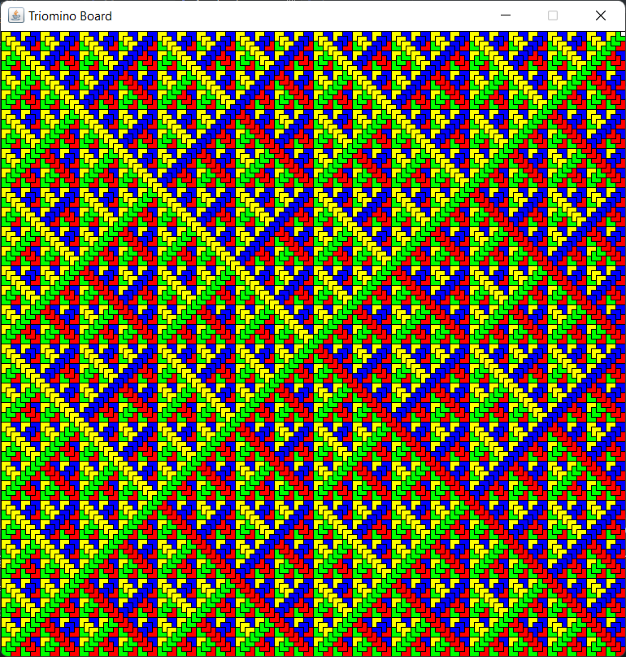
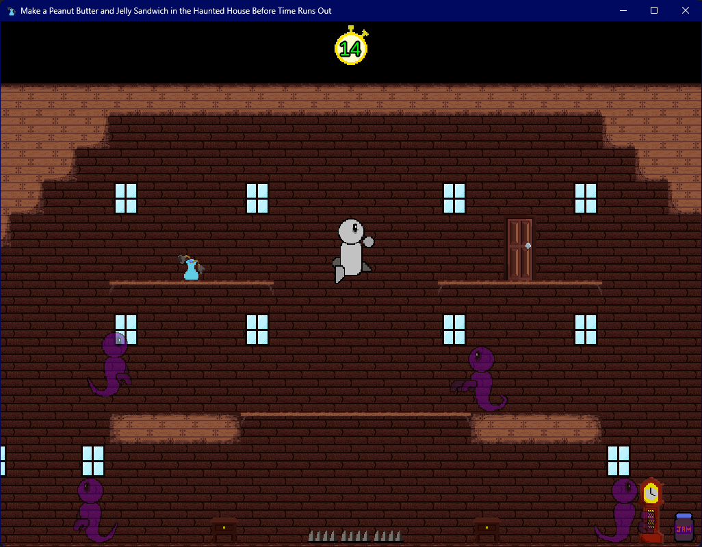
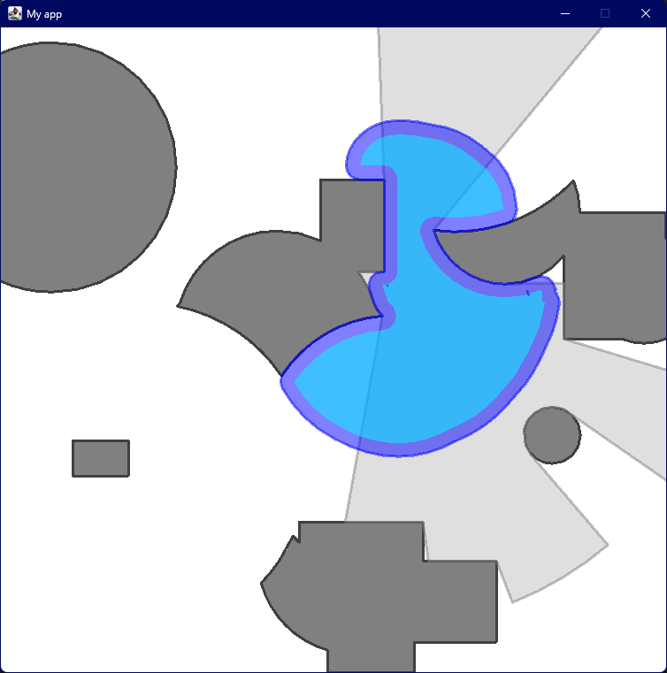
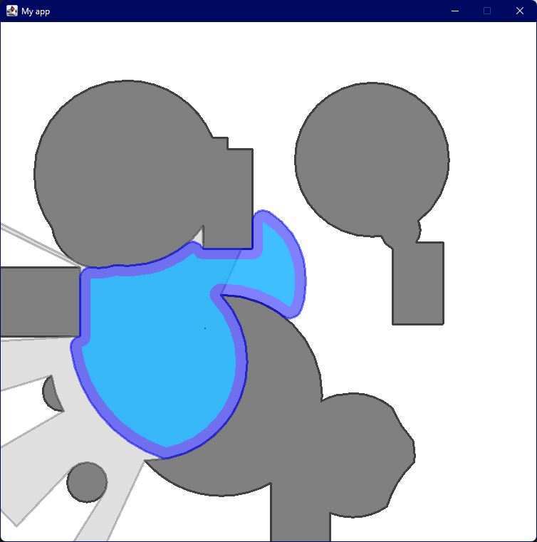
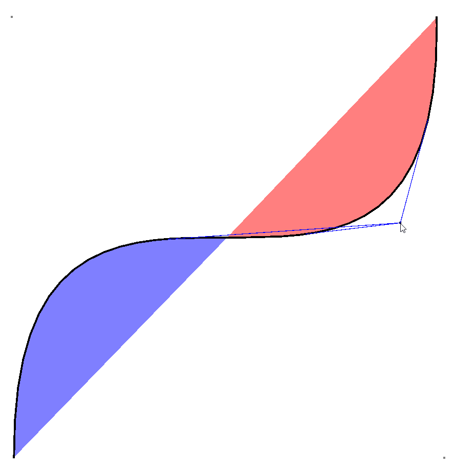
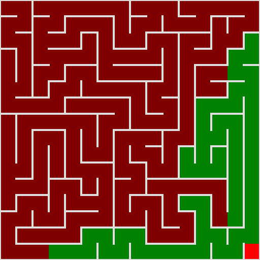
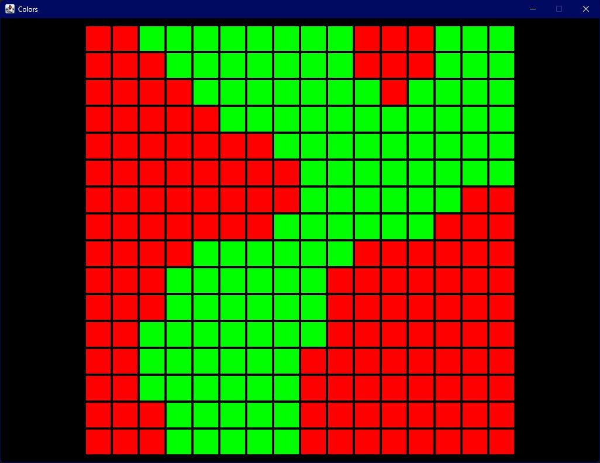
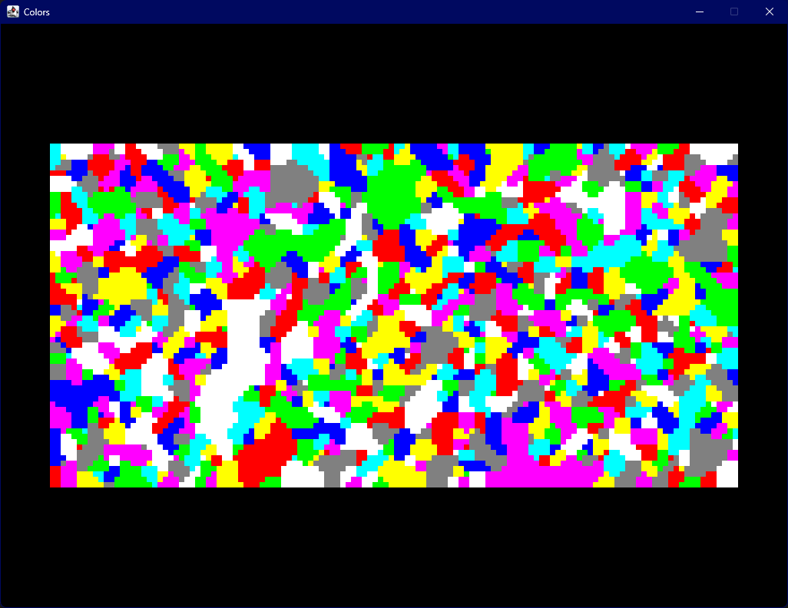
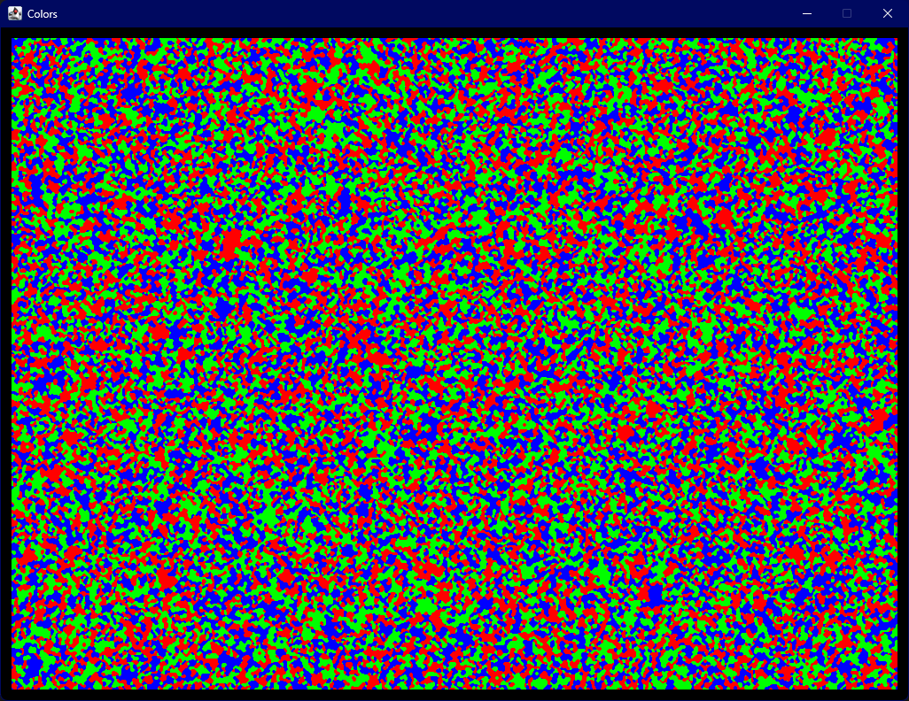
