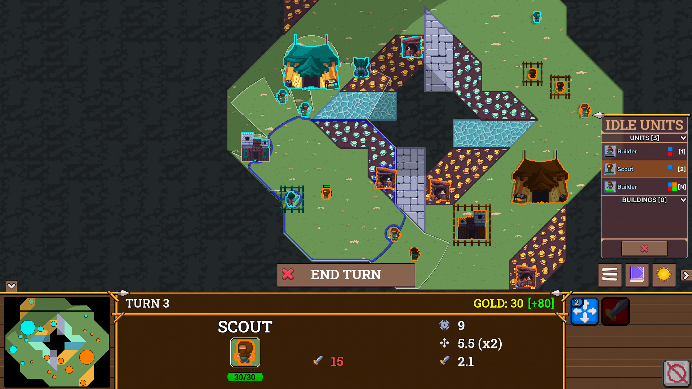

# Andy's Portfolio

This will be a semi-technical overview of my larger projects.

Generally, I close source anything that makes it past prototype phase and has the potential for revenue. 

My [other GitHub repositories](https://github.com/andy98725) represent prototypes or Proof of Concepts.
They _should_ be up to date on documentation as well.

## Skillset

All of these projects are Full Stack.
I like to use a variety of frameworks and languages; each project here uses its own stack.
This is not arbitrary, however. Much consideration goes into the benefits and drawbacks of each tool.

I pay particular mind to the architecture design ahead of time, leading to remarkably high SLA (99.9% uptime) in all published projects.
All of these projects use multithreading to separate calculation-heavy (model updating) concerns from low-latency (rendering, API) concerns.
Microservice architecture is also common, due to its propensity for at-needed scaling.

Although each and every project necessitated a mindful UX design and frontend implementation, the real meat of the projects is in the modeling and often the architecture.

# Base Wars

| Application Layer | Language Framework |
| ----------------- | ------------------ |
| Client View | Java Swing |
| Client Model | Java Awt |
| Backend | Ruby on Rails |
| Deployment Environment | Steamworks, Heroku |

## Overview

I acted as the sole developer (2017 - 2020) to a desktop video game written in Java Swing.

The game published [on Steam here](https://store.steampowered.com/app/1747110/Base_Wars/) in October of 2020, to critical success (~500 copies sold and counting).

The game represents a mature codebase of ~80,000 LoC with a variety of features:

- Netcode
    - Client & Server model, where the Server validates & propogates Events generated by Clients.
    - A Rails matchmaking server adds game clients to Redis queue and pairs them FIFO
- Multithreading
    - Render thread, input thread, and model update thread used to separate concerns and keep a consistent framerate
    - Asset loading thread used on startup
    - Immutable model state and event structure designed with synchronicity in mind to minimize race conditions
- UI design
    - Responsive frontend UI changes layouts according to screen size

# Iperf Professional Edition

| Application Layer | Language Framework |
| ----------------- | ------------------ |
| Frontend | React |
| Backend | Node Express |
| Database | MySQL |
| Deployment Environment | Heroku |

## Overview

Iperf PE is a remote scheduling tool for [Iperf 2](https://sourceforge.net/projects/iperf2/).
It is hosted on [iperf-pe.net](https://iperf-pe.net/) for production and [stg.iperf-pe.net](http://stg.iperf-pe.net/) for staging.

The app is designed with a minimalist UI, presenting essential information efficiently and clearly to the user.
The concepts of Nodes and Tests are succinctly explained and their creation interface is designed to be as streamlined as possible.

The architecture is as follows:

- Frontend (React)
    - Stores session token & handles auth appropriately
    - Makes async API calls and renders relevant data into custom table components
- Backend (Node Express)
    - Uses Sequelize ORM to model & represent Database tables
    - Provides API to frontend for User management and CRUD operations on Nodes and Tests
    - Scheduler thread picks up Tests to be started and calls specified Nodes
- Database (MySQL)
- Nodes (Golang)
    - A Node is a remote server which the backend can call upon to start / stop Iperf Tests
    - Uses U/P auth to validate endpoint calls
    - Reports status, uptime, and test results to Backend
    - Runs inside a Docker image for environmental flexibility
    - Source and image are currently provided to the user as a GitHub release

## Next Steps

As Iperf PE is still in early prototype phase, there are still fundamental improvements to be done.

- Provide the Node's Docker image directly from a container registry
- Reimplement auth on Nodes as server-provided JWT
- Add a Garbage Collector thread for any bad state Tests

# Idle Elemental

| Application Layer | Language Framework |
| ----------------- | ------------------ |
| Client View | Flutter |
| Client Model | Flutter Riverpod |
| Deployment Environment | Google App Store, Heroku |

## Overview

Idle Elemental is an unfolding mobile game still under active development.
It is scheduled for release on Android in March of 2024 and on browser in April of 2024.

It utilizes Dart's Flutter framework for efficient separation of Model and View.
The UI layout dynamically changes with a heavy dependence on game state, only showing features as they are unlocked.
Flutter was picked for its similarity to React while still being able to target multiple release platforms. 

This project was initially intended as an excercise in frontend design and optimizing for UX.
It also includes calculus-level math implementation for finding the fluctuation of resource values for any given delta-time within a highly interconnected system.

# Other Repositories

| Name | Description |
| ---- | ----------- |
| [haunt-jam](https://github.com/andy98725/haunt-jam) | A libGDX game made in 48 hours |
| [bw-launcher](https://github.com/andy98725/bw-launcher) | An Electron app that was used for version management |
| [triomino-tiling](https://github.com/andy98725/TriominoTiling) | A visually satisfying implementation of a triomino tiling theorem |
| [arbit-coin](https://github.com/andy98725/ArbitCoin) | A proof-of-concept cryptocurrency arbitrage detector |
| [true-movement](https://github.com/andy98725/True-Movement) | An original search algorithm for calculating true distance shapes |
| [bezier-curve-tangents](https://github.com/andy98725/Bezier-Curve-Tangents) | An original algorithm for finding tangent lines to any bezier curve |
| [mazenPy](https://github.com/andy98725/MazenPy) | A Reinforcement Learning implementation for solving mazes |
| [color-game](https://github.com/andy98725/Color_Game) | A cellular automata for generating clusters |
| [worms-n-guns](https://github.com/andy98725/Worms-N-Guns) | A proof of concept physics-based game |

